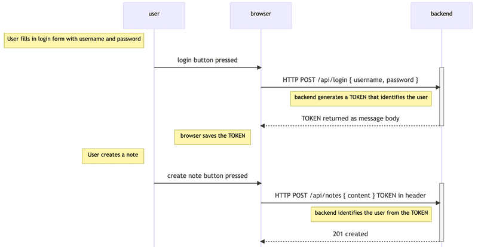

# Token authentication



- User starts by logging in using a login form implemented with React
- This causes the React code to send the username and the password to the server address /api/login as an HTTP POST request.
- If the username and the password are correct, the server generates a token that somehow identifies the logged-in user.
    - The token is signed digitally, making it impossible to falsify (with cryptographic means)
- The backend responds with a status code indicating the operation was successful and returns the token with the response.
- The browser saves the token, for example to the state of a React application.
- When the user creates a new note (or does some other operation requiring identification), the React code sends the token to the server with the request.
- The server uses the token to identify the user to generate data, authorize user to perform certain operations, etc.

Standards-Based

When creating the token, you have a few options but the standard to use would be JSON Web Tokens.

JSON Web Tokens (JWT), pronounced “jot”, are a standard since the information they carry is transmitted via JSON. 

JSON Web Tokens work across different programming languages: JWTs work in .NET, Python, Node.js, Java, PHP, Ruby, Go, JavaScript, and Haskell. So you can see that these can be used in many different scenarios.

JWTs are self-contained: They will carry all the information necessary within itself. This means that a JWT will be able to transmit basic information about itself, a payload (usually user information), and a signature.

JWTs can be passed around easily: Since JWTs are self-contained, they are perfectly used inside an HTTP header when authenticating an API. You can also pass it through the URL.

A JWT is easy to identify. It is three strings separated by .

Since there are 3 parts separated by a ., each section is created differently. We have the 3 parts which are:

header
payload
signature

Let's first implement the functionality for logging in

the functionality is:

user enters name and password in login form/page

client sends post request with that data

backend: The code starts by searching for the user from the database by the username attached to the request.

backend: Next, it checks the password, also attached to the request. (using bcrypt `compare`) Because the passwords themselves are not saved to the database, but hashes calculated from the passwords, the bcrypt.compare method is used to check if the password is correct:

```js
bcrypt.compare(password, user.passwordHash)
```

If the user is not found, or the password is incorrect, the request is responded with the status code 401 unauthorized. 

If the password is correct, a token is created with the method jwt.sign. The token contains the username and the user id in a digitally signed form.

```js
const userForToken = {
  username: user.username,
  id: user._id,
}

const token = jwt.sign(userForToken, process.env.SECRET)
```

The token has been digitally signed using a string from the environment variable SECRET as the secret. The digital signature ensures that only parties who know the secret can generate a valid token. The value for the environment variable must be set in the .env file. (or set as secret in deployment platform, etc.)

A successful request is responded to with the status code 200 OK. The generated token and the username of the user are sent back in the response body.

Now the code for login just has to be added to the application by adding the new router to app.js.

Limiting creating new notes to logged-in users

Let's change creating new notes so that it is only possible if the post request has a valid token attached. The note is then saved to the notes list of the user identified by the token.

There are several ways of sending the token from the browser to the server. We will use the `Authorization` header. The header also tells which authentication scheme is used. This can be necessary if the server offers multiple ways to authenticate. Identifying the scheme tells the server how the attached credentials should be interpreted.

The Bearer scheme is suitable for our needs.

In practice, this means that if the token is, for example, the string eyJhbGciOiJIUzI1NiIsInR5c2VybmFtZSI6Im1sdXVra2FpIiwiaW, the Authorization header will have the value:

```c
Bearer eyJhbGciOiJIUzI1NiIsInR5c2VybmFtZSI6Im1sdXVra2FpIiwiaW
```

The validity of the token is checked with `jwt.verify`. The method also decodes the token, or returns the Object which the token was based on (the `userForToken` we created previously).

```js
const decodedToken = jwt.verify(token, process.env.SECRET)
```

If the token is missing or it is invalid, the exception `JsonWebTokenError` is raised. We need to extend the error handling middleware to take care of this particular case:

The object decoded from the token contains the username and id fields, which tell the server who made the request.

If the application has multiple interfaces requiring identification, JWT's validation should be separated into its own middleware. An existing library like express-jwt could also be used.

## Problems of Token-based authentication

Token authentication is pretty easy to implement, but it contains one problem. Once the API user, eg. a React app gets a token, the API has a blind trust to the token holder. What if the access rights of the token holder should be revoked?

There are two solutions to the problem. The easier one is to limit the validity period of a token:

Once the token expires, the client app needs to get a new token. Usually, this happens by forcing the user to re-login to the app.

The error handling middleware should be extended to give a proper error in the case of an expired token:

The shorter the expiration time, the more safe the solution is. So if the token gets into the wrong hands or user access to the system needs to be revoked, the token is only usable for a limited amount of time. On the other hand, a short expiration time forces a potential pain to a user, one must login to the system more frequently.

The other solution is to save info about each token to the backend database and to check for each API request if the access rights corresponding to the tokens are still valid. With this scheme, access rights can be revoked at any time. This kind of solution is often called a server-side session.

The negative aspect of server-side sessions is the increased complexity in the backend and also the effect on performance since the token validity needs to be checked for each API request to the database. Database access is considerably slower compared to checking the validity of the token itself. That is why it is quite common to save the session corresponding to a token to a key-value database such as Redis that is limited in functionality compared to eg. MongoDB or relational database but extremely fast in some usage scenarios.

When server-side sessions are used, the token is quite often just a random string, that does not include any information about the user as it is quite often the case when jwt-tokens are used. For each API request, the server fetches the relevant information about the identity of the user from the database. It is also quite usual that instead of using Authorization-header, cookies are used as the mechanism for transferring the token between the client and the server.

Usernames, passwords and applications using token authentication must always be used over HTTPS. We could use a Node HTTPS server in our application instead of the HTTP server (it requires more configuration). On the other hand, the production version of our application is in Fly.io, so our application stays secure: Fly.io routes all traffic between a browser and the Fly.io server over HTTPS.

for repeated operations in routes, like checking if current user is authorized to delete a note:

```js
blogsRouter.delete('/:id', middleware.userExtractor, async (request, response) => {
  const parameterId = request.params.id
  const blog = await Blog.findById(parameterId)

  // here
  const currentUserId = jwt.verify(request.token, process.env.SECRET).id
  if (!currentUserId) {
    return response.status(401).json({ error: 'token invalid' })
  }

  if (blog.user.toString() !== request.user.id) {
    return response.status(401).json({ error: 'unauthorized user'})
  }
  
  await blog.deleteOne()
  response.status(204).end()
})
```

we can extract this repeated logic into a middleware function that will save the token and the user in the request itself as a property, so we can remove this logic from the route handlers and just access the request property directly:

```js
const tokenExtractor = (request, response, next) => {
  const authorization = request.get('authorization')

  if (authorization && authorization.startsWith('Bearer ')) {
    request.token = authorization.replace('Bearer ', '')
  } else request.token = null

  next()
}

const userExtractor = async (request, response, next) => {
  const decodedToken = jwt.verify(request.token, process.env.SECRET)
  if (!decodedToken.id) {
    return response.status(401).json({ error: 'token invalid' })
  }

  request.user = await User.findById(decodedToken.id)

  next()
}
```


