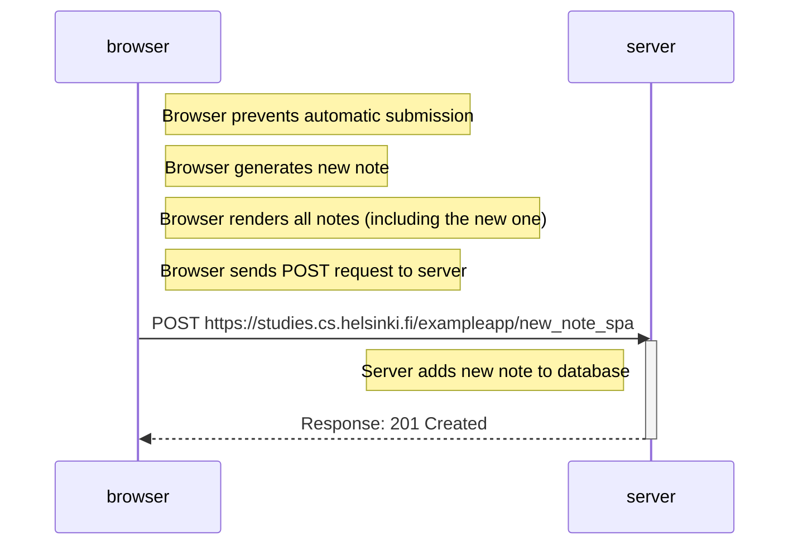

```mermaid
sequenceDiagram
    participant browser
    participant server

    Note right of browser: Browser prevents automatic submission
    Note right of browser: Browser generates new note
    Note right of browser: Browser renders all notes (including the new one)
    Note right of browser: Browser sends POST request to server
    browser->>server: POST https://studies.cs.helsinki.fi/exampleapp/new_note_spa
    activate server
    Note left of server: Server adds new note to database
    server-->>browser: Response: 201 Created
    deactivate server
```
